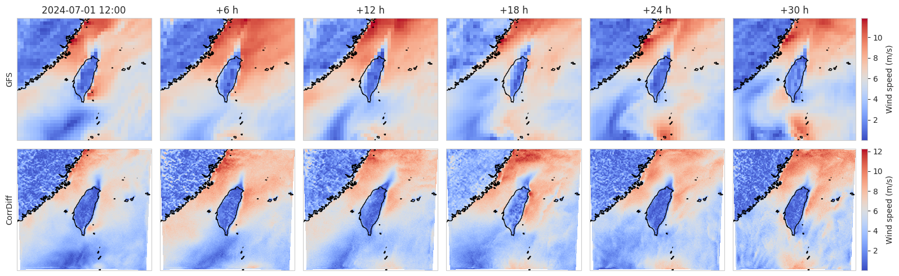

# Applying AI Weather Models with NVIDIA Earth-2

This workshop on using Earth-2 for weather forecasting has been presented at GTC 2025.

Link to the official DLI workshop: [DLI S-FX-31](https://learn.nvidia.com/courses/course-detail?course_id=course-v1:DLI+S-FX-31+V1)

The official workshop provides a fully managed compute environment and video recordings accompanying the exercise Notebooks.

## About this Course

Weather forecasts are indispensable for planning and decision-making in the public and private sector, with weather affecting anything from supply chain resiliency to energy production. Traditional numerical weather prediction systems are difficult to operate and place heavy demands on time and compute resources. With the recent advances in AI weather modeling, non-expert practitioners are now enabled to run forecasts tuned to their own needs. This course explores the possibilities offered by state-of-the-art AI weather prediction models and teaches how to integrate them into custom workflows. In this course, students will learn how AI weather models are revolutionizing the approach to weather forecasting. They will gain hands-on experience running AI weather forecasts, validating model outputs, and explore how super-resolution AI models can make fine-grained predictions. After the course, students will be able to build their own custom AI weather pipelines.

<p align="center">

</p>

## Learning Objectives

By participating in this course, you will:

* Learn the fundamentals of AI weather simulation and understand the difference between AI-based and numerical weather prediction.
* Gain hands-on experience running AI weather simulations with Earth2Studio for weather forecasting, historical analyses, and downscaling.
* Get familiar with the individual parts of a weather inference pipeline: Data sources, perturbation, forecast and diagnostic models, and IO handling.
* Validate the skill and calibration of weather forecasts with metrics commonly applied to deterministic and ensemble weather forecasts.
* Build a custom AI weather model inference pipeline, using the example of coupling a global forecast model with a regional downscaling model.
* Combine AI-generated weather data with downstream applications, following examples related to energy demand and production forecasts.

## Instructions

1. Build your environment using the Dockerfile:

```bash
docker build -t earth2dli1:0.1.0 .
```

2. Prepare the cache (model checkpoints and weather data):

```bash
docker run --gpus all --ipc host --pid host --shm-size 16g \
    -v /home/sweissenberg/repos/earth2dli1:/workspace/dli \
    -v /home/sweissenberg/data/earth2dli1:/workspace/data \
    --entrypoint python3 \
    earth2dli1:0.1.0 \
    /workspace/dli/data/fetch_cache.py
```

3. Start your container on a system with an NVIDIA GPU:

```bash
docker run --gpus all --ipc host --pid host --shm-size 16g \
    -v /home/sweissenberg/repos/earth2dli1:/workspace/dli \
    -v /home/sweissenberg/data/earth2dli1:/workspace/data \
    -p 8888:8888 \
    earth2dli1:0.1.0
```

4. Navigate to `localhost:8888` in a web browser.
5. Start with the notebook called `exercise_01_forecasting.ipynb`

## Resources

* [Official DLI workshop](https://learn.nvidia.com/courses/course-detail?course_id=course-v1:DLI+S-FX-31+V1)
* [Earth-2 model training workshop](https://github.com/openhackathons-org/End-to-End-AI-for-Science/tree/main/workspace/python/jupyter_notebook/GTC2026_HandsOnWithEarth-2)
* [Earth2Studio GitHub repository](https://github.com/NVIDIA/earth2studio)
